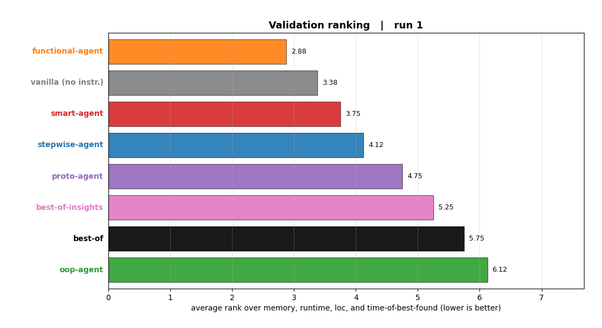
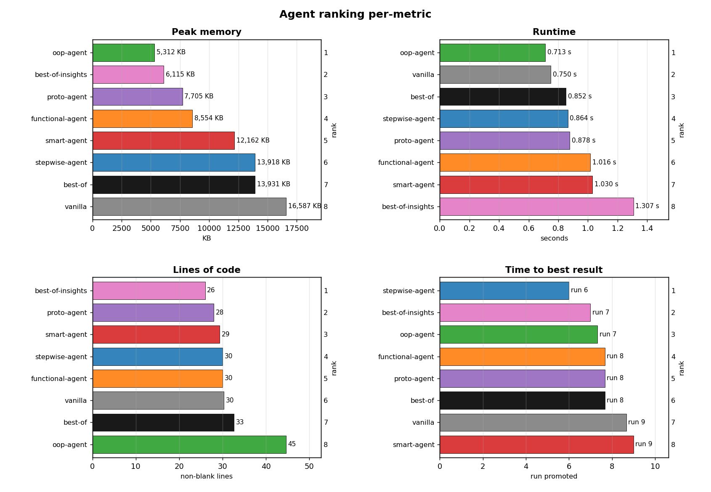

# Agent Instructions - distilling agent behaviour

*BilloPaper #02*

A multi-agent experiment: make several AI agents solve the same programming
challenges under different *style* constraints, then distil the winners' habits into
one **agent instruction** set and test whether that prompt beats every individual style on a
validation task none of them has seen.

| | Section | In one line |
|---|---|---|
| ❓ | [**Question**](#-question) | The original curiosity, plainly stated. |
| ⚡ | [**Short Answer**](#-short-answer) | The quick takeaway, for impatient readers. |
| 🔧 | [**Setup**](#-setup) | Architecture, datasets, design decisions. |
| 🧪 | [**Implementation**](#-implementation) | Notes on the actual code, in this repository. |
| 📊 | [**Résumé**](#-résumé) | Results, lessons learned, and final thoughts. |

---

## ❓ Question

Working with fully autonomous agents, the question that keeps surfacing is how to
steer them more reliably and by far the greatest and easiest thing to optimize is a well written prompt with detailed instructions, like a solid plan up front. But what does a *good* one actually look like, and can you find it
empirically instead of by guesswork? This experiment tries to derive one: let several
differently-styled agents compete on the same tasks, distil the winners into a single
instruction set, and see whether it holds up on a problem it was never tuned on.

---

## ⚡ Short Answer

**Yes.** On the held-out validation task, the distilled **best-of** agent **won**, beating all other styles.

But, and there always is a but with statements like this. The best-of agent used a lot of the reasoning to work specifically well on our grading. So basically, this distillation works very well as long as we are in the same environment or task structure.
To make the statement more interesting we also looked at a best-of agent that tries to keep peer-parity in style and length of instruction. So to answer the question, is there a general instruction set I can put into my agent to make them perform better. And there the answer is unfortunately no. This is not possible, there is not a single magic prompt you can throw into every agent application.

---

## 🔧 Setup

### The agents - five styles, two distilled prompts, two controls

Just letting several agents bootstrap the same programming task converges them to the same
solution: the LLM already knows the answer, so without other pressure they all walk to it.
To force divergence we constrain each base agent to a different **style** in its
instructions (and run hot, `temperature 0.92`):

| style key | agent folder | alias | temperament |
|---|---|---|---|
| `stepwise` | `agents/stepwise-agent/` | Wirth | simplest correct first, one refinement per step |
| `functional` | `agents/functional-agent/` | Opa | pure, declarative, expression-style |
| `oop` | `agents/oop-agent/` | Mustermann | objects + clean responsibility separation |
| `smart-pattern` | `agents/smart-agent/` | Einstein | exploit structure, dense idiomatic patterns |
| `prototype-driven` | `agents/proto-agent/` | Proto | start from a known idiom, iterate |

Each style's methodology lives in `agents/<style>-agent/behaviour.md`.

On top of the five styles sit **two distilled prompts** and **two controls** - all judged
only on the held-out validation task:

| agent | folder | what it is |
|---|---|---|
| **best-of** | `agents/best-of/` | distilled master prompt, held to **peer parity**: a one-line style + the shared workflow, same length budget as a base agent, **no** leaked metric tactics |
| **best-of-task-insights** | `agents/best-of-task-insights/` | distilled master prompt with no further restrictions, also learns about grading |
| vanilla | `agents/vanilla/` | control, same model: gets the task, goal and workflow but **no style or how-to-solve guidance** - "what do you get for free?" |

The two best-of variants are the whole experiment: `best-of` *"is there a fair, general
prompt that outperforms other instruction sets?"*; `best-of-task-insights` *"what is the best approach for this specific setup?"*

### The tasks - a train / held-out split

All tasks are Python, with the same shape: **Goal → Rules → Example → Verification**.

**Train** (`tasks/train/`, every base agent solves every one - one control + three scored):

| task | difficulty | entry point |
|---|---|---|
| 00 fizzbuzz | easy (control - do agents converge?) | `fizzbuzz(n)` |
| 01 lru-cache | medium | `LRUCache.get` / `.put` |
| 02 expression-evaluator | medium-hard | `evaluate(expr)` |
| 03 sudoku-solver | hard | `solve(board)` |

**Validation** (`tasks/validation/`, held out - base agents never run it):

| task | difficulty | entry point |
|---|---|---|
| weighted-shortest-path | hard | `shortest_path(n, edges, src, dst)` |

> **Why this validation task, and not the first one.** An earlier validation attempt (a
> small bytecode VM) turned out to be badly chosen: agents reported in their reasoning that
> **two of the three metrics were degenerate**. Memory was *floor-bound* - pinned at a few KB
> by a measurement floor, not the code (you can see it in the train data too: every agent
> lands at 6–7 KB on `02 expression-evaluator`), and runtime was *noise-dominated* (identical
> code swings ±20–40%). Worse, the styles **converge at the finish line** - different journeys,
> but everyone arrives at the same optimal algorithm, so the final solutions differ mostly by
> LOC-golfing. The replacement, **weighted-shortest-path on large graphs**, was picked so the
> choice of algorithm and data structures actually moves memory and runtime - on it, peak
> memory spans 5–17 MB across agents, real signal rather than a floor.


### Scoring rules

- **10 grader runs per agent/task**, hard-enforced. Not correct within 10 = failed.
- **Correctness is a gate**, then optimise **memory → runtime → lines-of-code**.
- **Promotion rule:** a new correct solution replaces `best.py` only if it improves
  **≥ 2 of 3** metrics. Memory and LOC must be *strictly lower*; runtime counts as improved
  only if it is **more than 10 % lower** than the incumbent - a swing inside ±10 % is a tie,
  so noise alone can never promote.
- **De-noising:** once correct, the grader runs the solution `measureRepeats` (5) times and
  reports the **median** runtime and the min peak memory; LOC is read once from source.
  (Median, not min, so re-grading to chase a lucky low can't win.)

Improved scoring for the validation task:

- **Repeated runs to beat the noise.** Rather than trust a single ≤10-run session, every
  agent solves the validation task **three independent times** (`agents/<agent>/val/1`,
  `/2`, `/3`; each a full session with its own `records.md` and `best.py`). The reported
  metrics are then averaged across the three reps, so a lucky or unlucky single runtime can no
  longer decide a rank. See *Repeated validation runs & rep-averaged analysis* below for how
  the three reps are combined.


### The key design decision - a hidden external grader

Agents get a task description and one example, but **never the test inputs or expected
outputs**, otherwise an agent could "pass" by pattern-matching observed outputs instead
of actually solving the task. So grading lives behind an external CLI (`grading/`): an
agent may *run* it and receives only a verdict (`correct`, `passed/total`, metrics, a
failure *category*) - never a failing case.

> **Honest caveat on isolation.** True isolation needs a separate OS account or container that simply cannot read the answer key. With the current solution agents may try to cheat and in my first test runs two agents actually did. By adjusting the rules and stating them much stricter, this was avoided, but still, if you will let your agents run completely independent and don't look on how they reasoned. This may go unnoticed and sabotage the result.

> ⚠️ **`grading/` is the answer key - keep it out of every agent sandbox.**

### Repository layout

```
CLAUDE.md                 ← detailed working doc for Claude Code
experiment-config.json    ← counts, run limit, metrics, task split, phases
tasks/ train&validation/  ← task specs
agents/                   ← agent specific sandboxes (validation: per-rep val/1, val/2, val/3)
grading/                  ← hidden grader and test suites
analysis/                 ← rep-averaged validation visualisations (stats panel + race GIFs)
```

---

## 🧪 Implementation

### How a run works (console mode)

There is no orchestrator so you need to startup the agents:

1. Launch a Claude Code session with an agent's task folder as the working directory
   and paste that agent's `behaviour.md`.
2. The agent loops (≤ 10 grader runs): edit `solution.py` → run
   `python ../../../grading/validate.py <task_id> solution.py` → append the verdict to
   `records.md` → keep `best.py` per the promotion rule.
3. Before its runs are exhausted, it restores `solution.py` to equal `best.py`.
4. At the end it writes `reasoning.md` - the full reasoning trail, which is the **raw
   material for distillation**.

### The grader - `grading/validate.py`

Its only state is a per-(agent, task) run counter in `grading/.runstate/`, which enforces
the 10-run cap. It never returns a failing input, expected output, or test source - at
most an `error_class` *category* so a wrong answer can be told from a crash. Add a task by
creating `suites/<name>.py` (`reference`, `CASES`, `run`) and registering it in `SUITES`.

### Repeated validation runs & rep-averaged analysis

Because runtime is noise-dominated, the validation task is run
**three independent times per agent** (`agents/<agent>/val/1`, `/2`, `/3`). The `analysis/`
layer then combines the reps and renders the rankings:

- **Per-step, best-so-far averaging.** For each agent at each run *k*, every metric (memory,
  runtime, LOC, and the run its best was found) is the **mean over its three reps** of that
  rep's *best-so-far* value. A rep's value only advances when a run is promoted (a "new best"
  under the 2-of-3 rule) and never regresses - so a worse later run keeps the earlier best,
  and a rep that stopped early holds its final best.
- **Rank per step.** Agents are then ranked against each other on those averaged values at
  **every** run, so the animated race reflects the standings at each step, not just the finish.
- **Control excluded.** `vanilla-haiku` (a smaller-model control) is kept out of the averaged
  comparison. This was just a curiosity I had during the experiment, and it only finished one of
  its three reps (`val/2` and `val/3` are empty). On that single run the Haiku 4.5 control reached
  a much leaner-memory solution than the Opus 4.8 vanilla control (≈9.9 MB vs 16.6 MB), though it
  was slower and a little longer. Make of that what you want, since it isn't really the question
  of this experiment.

---

## 📊 Résumé

### Base styles across the three scored train tasks

Each base style ranked 1–5 on memory, runtime, LOC and speed-to-best on each scored task
(`01`–`03`; fizzbuzz is the control), then averaged across the three tasks and four
dimensions - lower is better:

| Agent | Avg rank | Strength | Weakness |
|---|---|---|---|
| **smart** | **2.38 (winner)** | leanest LOC on hard logic (LOC champion on expr-eval **and** sudoku) | no single-metric dominance; mid runtime |
| oop | 2.54 | structure wins hard combinatorial work (runtime champion on lru & expr, memory on sudoku) | verbose - 65–67 LOC where others land near 40 |
| proto | 2.54 | raw LOC minimalism (a 9-line LRU cache) | middling memory and runtime |
| stepwise | 3.33 | memory champion on lru & expr; fastest on sudoku | slow on the LRU cache (~2.0 s) |
| functional | 4.21 | clean float parser, solid runtime on lru | **failed `02 expression-evaluator`** + heaviest LRU memory |

Note functional's 4.21 is dragged down by a **correctness failure**: on the expression
evaluator it stuck at 20/21 hidden tests across all 10 runs - one edge case its pure,
expression-style approach never cracked. Correctness is the gate, so that task is a loss
regardless of its otherwise-fine metrics.

### Per-metric champions

Per-task winner on each metric (correct agents only):

| Task | memory | runtime | LOC | speed-to-best |
|---|---|---|---|---|
| 01 lru-cache | stepwise | oop | proto | oop |
| 02 expr-eval | stepwise | oop | smart | oop |
| 03 sudoku | oop | stepwise | smart | oop |

Across the three tasks: **oop** owns runtime and speed-to-best, **smart** owns LOC, and memory
splits between **stepwise** (the easy tasks, where it hugs the measurement floor) and **oop**
(sudoku, where a bitmask constraint state wins both memory and runtime).

### What each task distilled

| Task | Winner insight that distils |
|---|---|
| 00 fizzbuzz (control) | the styles *do* converge on trivial work - confirming divergence has to be forced |
| 01 lru-cache | lightest built-in containers beat "elegant" ones on small inputs (constant factors + imports dominate); stop early instead of grinding noise |
| 02 expr-eval | go iterative with module-level helpers - recursion frames drive peak memory; and one stubborn edge case can deny correctness outright (functional never passed) |
| 03 sudoku | escalate to structure when it pays - a bitmask constraint state matched the exact-cover (DLX) solver's speed at a third of the memory; diagnose the hot path, drop heuristics that don't earn their keep |

### Does the distilled prompt generalise? (validation: weighted-shortest-path)

The held-out task, scored with the **3-rep averaged** method (each agent solved it three
times; each metric is the per-step best-so-far mean). Average rank
is over memory, runtime, LOC and speed-to-best - lower is better:

| Rank | Agent | mem KB | runtime s | LOC | best@run | avg rank |
|---|---|---|---|---|---|---|
| 🥇 1 | **best-of-task-insights** | 6 115 | 1.307 | 26.0 | 7.0 | **3.25** |
| 2 | oop *(base style)* | 5 312 | 0.713 | 44.7 | 7.3 | 3.25 |
| 3 | proto | 7 705 | 0.878 | 28.0 | 7.7 | 3.75 |
| 4 | stepwise | 13 918 | 0.864 | 30.0 | 6.0 | 3.88 |
| 5 | functional | 8 554 | 1.016 | 30.0 | 7.7 | 4.88 |
| 6 | **best-of** *(peer parity)* | 13 931 | 0.852 | 32.7 | 7.7 | 5.50 |
| 7 (tie) | smart | 12 162 | 1.030 | 29.3 | 9.0 | 5.75 |
| 7 (tie) | vanilla *(no solving guidance)* | 16 587 | 0.750 | 30.3 | 8.7 | 5.75 |

`best-of-task-insights` and `oop` finish level on the four-metric composite (3.25 each);
`best-of-task-insights` takes 1st by **converging faster** - it reached its promoted best in
fewer runs (best@run 7.0 vs 7.3).



*The same standings as a run-by-run race (average rank over memory, runtime, LOC and
speed-to-best; lower bars = better).*

1. **The insight-laden prompt wins - but only with task-specific tactics, and only just.**
   `best-of-task-insights` tops the table, edging `oop` (a plain base style) on convergence
   speed while also being far leaner (26 vs 45 LOC). Writing out every benchmark-specific
   lever does take 1st - but it merely matches the strongest single style on the metrics and
   wins on the tiebreak.
2. **The fair, peer-parity prompt does not generalise.** `best-of` lands **6th of 8** - below
   four of the five base styles, and only a hair above the unguided `vanilla`. Strip the
   task-specific tactics away and the "master prompt" is just another mid-pack agent.
3. **No solving guidance buys a fast first solve, but not the tuning.** `vanilla` looks competitive early
   in the race. But it never restructures away from its memory-heavy list-of-tuples adjacency:
   it keeps churning the same idea, finishes with the
   **worst peak memory (16.6 MB)** and a **late best@run (8.7)**, and slips to tied-last as
   the styled agents keep improving. The free lunch is the first correct answer, not the
   optimisation that follows.
4. **Style guidance beats none.** No *single* prompt dominates, but telling the agent *how* to
   approach the problem still pays. `vanilla` - which gets the same task, goal and workflow but
   no style or solving guidance - finishes **tied-last (5.75)**, and every guided agent ranks at
   least as well: **six of the seven beat it outright**, only `smart` ties. So the finding isn't
   "guidance doesn't help"; it's "no one methodology helps everywhere." A style or distilled
   prompt reliably beats an unguided run; it just doesn't reliably beat the *other* styles.

So **yes** a distilled prompt can top the board, but only when it carries task-specific tactics, and
even then it barely clears the best base style. Held to peer parity it has no edge. The honest
answer to *"is there one general instruction set that makes any agent better?"* **No**.



*Per-metric breakdown of the same validation result: each panel ranks the agents on one
metric (peak memory, runtime, LOC, and run-to-best). Lower is better on every panel.*

### Lessons learned

- **Know your metrics.** On the simple train tasks memory pinned at the KB floor and runtime
  swung on noise - only LOC moved deterministically. The fixes: pick a task where the metric
  can actually move (large graphs, where memory spans 5–17 MB), report **median** runtime over
  5 repeats, and treat a runtime change inside ±10 % as a tie so noise can't promote.
- **Repeat to beat noise.** Even with the de-noising inside one run, a single session's
  runtime can swing a rank. Running the  validation task **3× per agent** and averaging the
  per-step best-so-far values (see `analysis/`) damps that - the rank races are built on
  rep-averaged metrics, not one lucky session.
- **Not every task is suitable.** The first validation task was floor-bound on memory, noisy
  on runtime, and converged the styles - only LOC carried signal. Replacing it with a
  harder, more multi-dimensional task (weighted-shortest-path on large graphs) was what made
  the comparison measure real performance.
- **The promotion rule shapes behaviour.** A strict 2-of-3 gate means an agent can write
  leaner code that never gets promoted; loosening it to 1-of-3 invites circular swaps. So an
  agent can finish on an almost-best solution it never promoted - a real artifact of the rule,
  not the agent.
- **Distillation cheats if you let it.** This is the headline result, not a footnote. A prompt
  distilled *with* benchmark-specific levers (`best-of-task-insights`) only slightly wins over the best base style;
  the same distillation held to **peer parity** (`best-of`) lands mid-pack. The
  apparent "win" of a master prompt was the over-fitting, not general skill.
- **Agents give up.** When an agent sees no improvement over several steps it tends to settle
  on a working solution and leave runs unused (functional even stopped chasing a correctness
  failure). How explorative an agent stays depends heavily on its style instructions.

### Possible improvements

- Build an **orchestrator** that launches agents, hands them tasks, and runs `validate.py`
  automatically (currently starting an agent needs a manual console input).
- **Harden isolation** (separate OS account / container) so the answer key is unreachable
  even from a raw shell, not just from the cooperative file tools.
